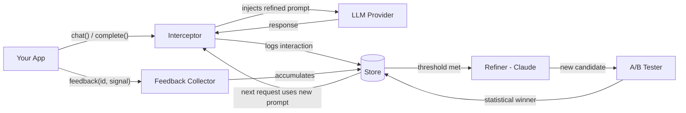

<p align="center">
  
</p>

<h3 align="center">Your AI gets smarter every day. Automatically.</h3>

<p align="center">
  <a href="https://pypi.org/project/autorefine/"></a>
  <a href="https://pypi.org/project/autorefine/"></a>
  <a href="https://github.com/upwell-solutions/autorefine/actions"></a>
  <a href="https://github.com/upwell-solutions/autorefine/blob/main/LICENSE"></a>
  <a href="https://github.com/upwell-solutions/autorefine/stargazers"></a>
</p>

<p align="center">
  AutoRefine sits between your app and the LLM. It intercepts every call, collects user feedback, and <strong>automatically rewrites your system prompts</strong> to fix what's broken — without changing a single line of your application code.
</p>

---

## Quickstart

```python
from autorefine import AutoRefine

client = AutoRefine(api_key="sk-...", model="gpt-4o", refiner_key="sk-ant-...", auto_learn=True)
resp = client.complete("You are a helpful assistant.", "How do I make pasta?")
client.feedback(resp.id, "thumbs_up")  # your prompt auto-improves from here
```

## Demo

> **Coming soon**: Record a 30-second GIF showing the dashboard improvement curve
> climbing as feedback accumulates. Use [asciinema](https://asciinema.org/) for
> the terminal or a screen recorder for the web dashboard.

<p align="center"><em>Screenshot placeholder — run <code>autorefine dashboard</code> to see it live</em></p>

---

## How it works



1. **Intercept** — Every LLM call passes through invisible middleware that swaps in the latest refined prompt
2. **Collect** — Your app records feedback (`thumbs_up`, `thumbs_down`, `correction`) tied to specific responses
3. **Refine** — Claude analyzes feedback patterns and surgically patches the prompt
4. **Validate** — Candidates are A/B tested with a Welch's t-test (no scipy needed)
5. **Promote** — Winners are promoted automatically. Rollback anytime

## Why AutoRefine?

| Manual prompt engineering | With AutoRefine |
|---------------------------|-----------------|
| You guess what's wrong | Feedback tells you exactly what's wrong |
| You rewrite the whole prompt | The refiner patches only what's broken |
| You hope it's better | A/B testing proves it's better |
| One person's opinion | Statistical significance from real users |
| No history or rollback | Full version history with instant rollback |
| Hours of iteration | Runs automatically in the background |

## Features

| Category | What you get |
|----------|-------------|
| **Core loop** | Zero-code prompt improvement, surgical meta-prompt, conditional logic over absolutes |
| **Feedback** | Thumbs up/down, corrections, custom scores, embeddable HTML widget |
| **Validation** | A/B testing with Welch's t-test, PII scrubbing, feedback noise filtering |
| **Providers** | OpenAI, Anthropic, Mistral, Ollama, any OpenAI-compatible API |
| **Storage** | JSON (dev), SQLite (production), PostgreSQL (distributed) |
| **Security** | Encryption at rest, multi-tenant namespaces, API key scrubbing, CORS, rate limiting |
| **Analytics** | Improvement curves, failure patterns, cost tracking, ROI reports |
| **Dashboard** | Real-time web UI with Chart.js, diff viewer, A/B test controls |
| **Async** | Native async support for OpenAI, Anthropic, Ollama |
| **CLI** | `autorefine init`, `dashboard`, `prompts`, `stats`, `export`, `reset` |

## Install

```bash
pip install autorefine
```

With extras:

```bash
pip install autorefine[openai]        # OpenAI GPT models
pip install autorefine[anthropic]     # Anthropic Claude
pip install autorefine[dashboard]     # Web dashboard (FastAPI + uvicorn)
pip install autorefine[postgres]      # PostgreSQL storage
pip install autorefine[encryption]    # Fernet encryption at rest
pip install autorefine[all]           # Everything
```

## Usage

### Basic

```python
from autorefine import AutoRefine

# Create client (reads .env automatically)
client = AutoRefine(
    api_key="sk-...",
    model="gpt-4o",
    refiner_key="sk-ant-...",   # optional — enables auto-refinement
    auto_learn=True,             # refine when feedback threshold is met
)

# Set your initial prompt
client.set_system_prompt("You are a helpful cooking assistant.")

# Use it like any LLM client
resp = client.chat("You are helpful.", [{"role": "user", "content": "How do I make pasta?"}])
print(resp.text)

# Collect feedback from your users
client.feedback(resp.id, "thumbs_up")
client.feedback(resp.id, "thumbs_down", comment="Too verbose")
client.feedback(resp.id, "correction", comment="The correct method is...")
```

### Async

```python
from autorefine import AsyncAutoRefine

client = AsyncAutoRefine(api_key="sk-...", model="gpt-4o", auto_learn=True)
resp = await client.complete("Be helpful.", "What is 2+2?")
await client.feedback(resp.id, "thumbs_up")
```

### Decorator

```python
from autorefine import autorefine

@autorefine(api_key="sk-...", refiner_key="sk-ant-...", auto_learn=True)
def ask(system: str, prompt: str):
    pass  # AutoRefine handles the call

resp = ask("You are helpful.", "What is 2+2?")
ask.feedback(resp.id, "thumbs_up")
```

### CLI

```bash
autorefine init                           # interactive setup
autorefine dashboard --port 8787          # launch web UI
autorefine prompts list                   # list prompt keys
autorefine prompts show default           # print active prompt
autorefine prompts diff default 1 2       # colored diff
autorefine stats                          # feedback/cost summary
autorefine export default --format json   # export history
```

## Examples

| Example | Description |
|---------|-------------|
| [`quickstart.py`](examples/quickstart.py) | 10-line getting started |
| [`chatbot_example.py`](examples/chatbot_example.py) | Terminal chatbot with feedback loop |
| [`customer_support.py`](examples/customer_support.py) | Multi-category prompts (billing + tech) |
| [`content_generator.py`](examples/content_generator.py) | Editorial correction feedback |
| [`async_chatbot.py`](examples/async_chatbot.py) | AsyncIO + FastAPI web endpoint |
| [`flask_app_with_widget.py`](examples/flask_app_with_widget.py) | Flask chatbot with feedback widget |

## Comparison

| Feature | AutoRefine | DSPy | PromptLayer | Humanloop | LangSmith |
|---------|-----------|------|-------------|-----------|-----------|
| Auto prompt refinement | **Yes** | Compilation | No | No | No |
| Zero code changes | **Yes** | No | Logging only | Logging only | Logging only |
| A/B testing | **Built-in** | No | Manual | Manual | No |
| PII scrubbing | **Built-in** | No | No | No | No |
| Self-hosted | **Yes** | Yes | SaaS | SaaS | Partial |
| Open source | **MIT** | MIT | Partial | No | Partial |
| Cost tracking | **Per-call** | No | No | Yes | Yes |
| Pricing | **Free** | Free | $29+/mo | $79+/mo | $39+/mo |

## Configuration

All settings via env vars (`AUTOREFINE_*`) or constructor args. See [full reference](https://upwell-solutions.github.io/autorefine/configuration/).

## Contributing

We welcome contributions! Please:

1. Fork the repo
2. Create a feature branch (`git checkout -b feature/amazing-feature`)
3. Write tests for your changes
4. Ensure `ruff check` and `pytest` pass
5. Submit a PR

```bash
git clone https://github.com/upwell-solutions/autorefine.git
cd autorefine
pip install -e ".[dev]"
pytest tests/ -v
ruff check autorefine/ tests/
```

## License

MIT -- see [LICENSE](LICENSE).

---

<p align="center">
  <strong>Built with care by <a href="https://upwelldigitalsolutions.com">Upwell Digital Solutions</a></strong>
  <br>
  We help companies build smarter AI products.
  <br>
  If you need AI consulting, SEO strategy, or custom software development,
  <a href="https://upwelldigitalsolutions.com">get in touch</a>.
</p>
