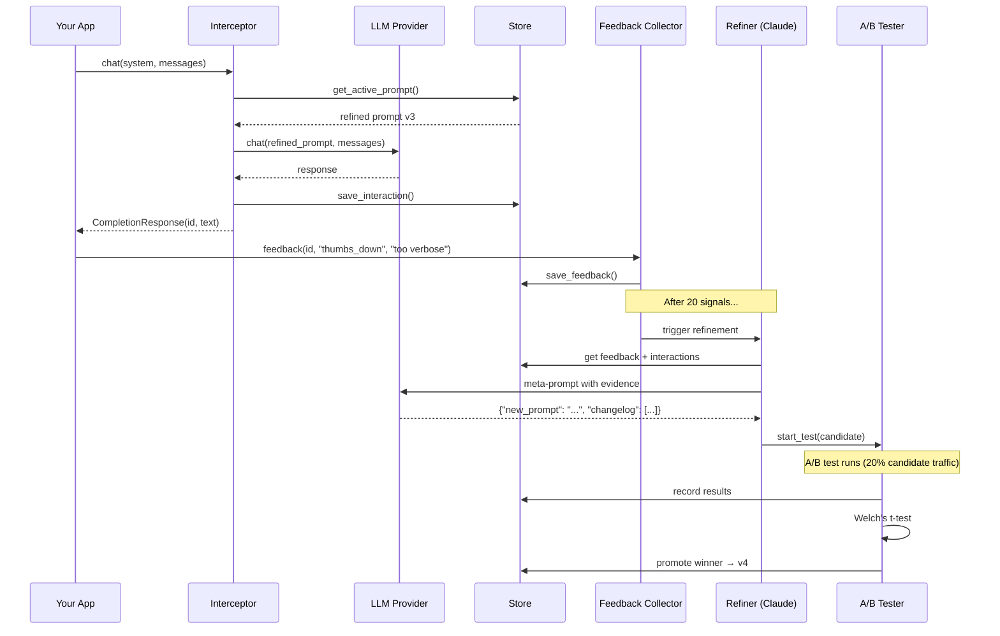
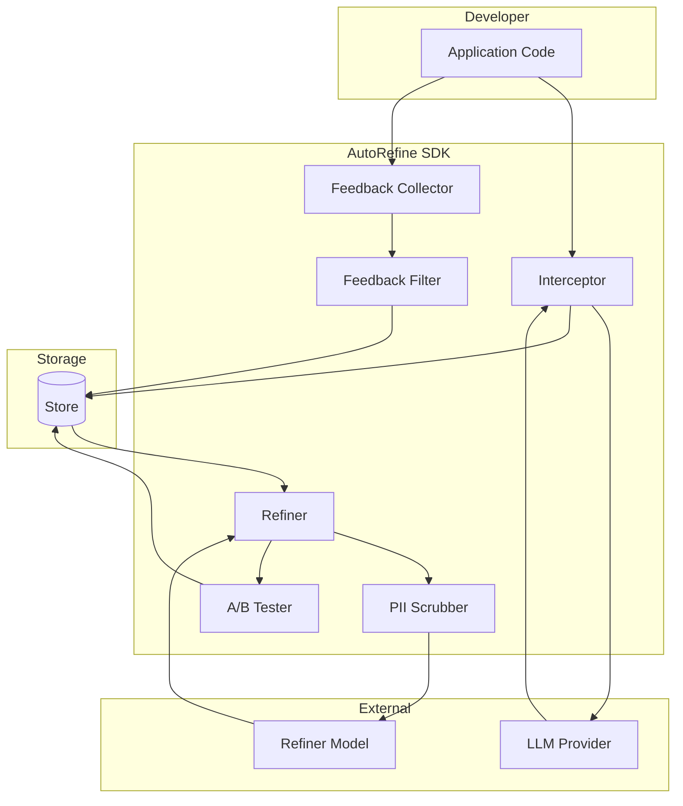

# Architecture

## The learning loop



## Module map

```
autorefine/
├── client.py            # Public API (AutoRefine class)
├── async_client.py      # Async version (AsyncAutoRefine)
├── interceptor.py       # Invisible middleware
├── feedback.py          # Feedback ingestion + batching
├── refiner.py           # Meta-prompt + Claude refinement
├── ab_testing.py        # Welch's t-test A/B validation
├── models.py            # Pydantic data models
├── config.py            # Pydantic settings (env vars)
├── _retry.py            # Exponential backoff retry
├── exceptions.py        # Exception hierarchy
├── providers/
│   ├── base.py          # Abstract base (sync + async)
│   ├── openai_provider  # OpenAI + compatible APIs
│   ├── anthropic_provider # Anthropic Claude
│   ├── ollama_provider  # Ollama (local models)
│   └── mistral_provider # Mistral AI
├── storage/
│   ├── base.py          # Abstract store interface
│   ├── json_store.py    # JSON file (dev)
│   ├── sqlite_store.py  # SQLite (production)
│   └── postgres_store.py # PostgreSQL (distributed)
├── pii_scrubber.py      # Regex PII redaction
├── feedback_filter.py   # Noise filtering
├── notifications.py     # Webhook + callback alerts
├── cost_tracker.py      # Cost tracking + budget
├── analytics.py         # Metrics + ROI reports
├── widget.py            # Embeddable HTML widget
├── cli.py               # CLI (click)
└── dashboard/
    ├── server.py         # FastAPI app
    ├── api.py            # REST endpoints
    ├── widget_endpoint.py # Widget feedback handler
    └── templates/
        └── index.html    # Dashboard SPA
```

## Data flow



## Design principles

1. **Invisible** — The interceptor never raises exceptions from AutoRefine internals. Provider errors propagate; everything else is logged and swallowed.

2. **Surgical** — The refiner patches gaps rather than rewriting from scratch. Conditional logic over absolute rules.

3. **Conservative** — A/B testing with statistical significance. No candidate is promoted without evidence.

4. **Privacy-first** — PII scrubbed before reaching the refiner. Feedback noise filtered before refinement.

5. **Budget-aware** — Monthly cost caps with automatic refinement pausing.
