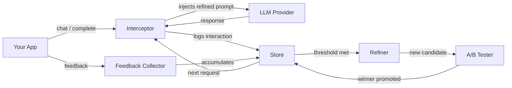

---
hide:
  - navigation
---

<div class="hero" markdown>

# AutoRefine

**Make your AI smarter with 3 lines of code.**

Drop-in prompt refinement that learns from user feedback and automatically
improves your system prompts — no code changes needed.

<div class="hero-buttons">
<a href="getting-started/" class="primary">Get Started</a>
<a href="api-reference/" class="secondary">API Reference</a>
</div>
</div>

---

## Install

<div class="termynal">
<span class="command">pip install autorefine</span>
<span class="output">Successfully installed autorefine-0.1.0</span>
</div>

With provider extras:

```bash
pip install autorefine[openai]       # OpenAI GPT models
pip install autorefine[anthropic]    # Anthropic Claude
pip install autorefine[dashboard]    # Web dashboard
pip install autorefine[all]          # Everything
```

## Quickstart

```python
from autorefine import AutoRefine

client = AutoRefine(
    api_key="sk-...",
    model="gpt-4o",
    refiner_key="sk-ant-...",   # enables auto-refinement
    auto_learn=True,
)
client.set_system_prompt("You are a helpful assistant.")

response = client.complete("You are a helpful assistant.", "How do I make pasta?")
print(response.text)

# Wire this to your app's thumbs up/down buttons
client.feedback(response.id, "thumbs_up")
```

That's it. After enough feedback, your prompt automatically improves.

## How it works



1. **Intercept** — Every LLM call passes through invisible middleware that swaps in the latest refined prompt.
2. **Collect** — Your app records feedback tied to specific responses.
3. **Refine** — A refiner model (Claude) analyses patterns and surgically patches the prompt.
4. **Validate** — Candidates are A/B tested with statistical significance testing.
5. **Promote** — Winners are promoted automatically. You can rollback anytime.

## Key features

<div class="grid cards" markdown>

-   :material-brain:{ .lg } **Zero-code prompt improvement**

    Prompts refine automatically from user feedback. No prompt engineering needed.

-   :material-shield-check:{ .lg } **A/B testing built in**

    Welch's t-test validates candidates before promotion. No scipy dependency.

-   :material-eye-off:{ .lg } **PII scrubbing**

    Emails, phones, SSNs, API keys redacted before reaching the refiner.

-   :material-chart-line:{ .lg } **Analytics dashboard**

    Real-time improvement curves, feedback feed, and cost tracking.

-   :material-swap-horizontal:{ .lg } **Provider agnostic**

    OpenAI, Anthropic, Mistral, Ollama — or any OpenAI-compatible API.

-   :material-lock:{ .lg } **Budget guardrails**

    Monthly cost caps with automatic refinement pausing.

</div>

## Who is it for?

- **Startups** shipping AI features who want prompts to improve from real usage
- **Enterprise teams** who need auditable prompt versioning and rollback
- **Agencies** managing multiple AI products with independent prompt namespaces
- **Solo developers** who want their chatbot to get smarter over time

---

<p style="text-align: center; color: var(--md-default-fg-color--light); font-size: 0.9rem;">
AutoRefine is built and maintained by
<a href="https://upwelldigitalsolutions.com">Upwell Digital Solutions</a>
— AI consulting, SEO, and software development.
</p>
